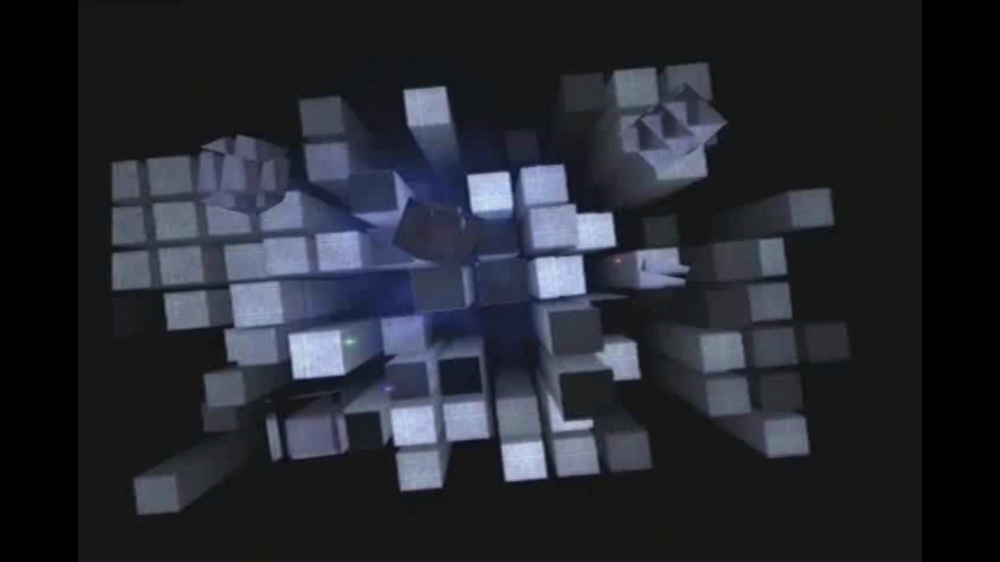
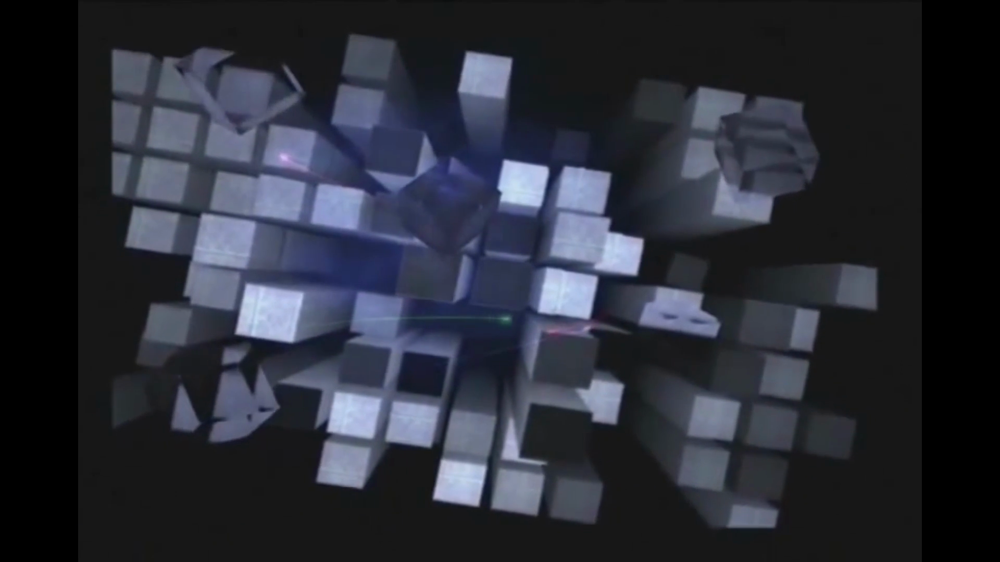
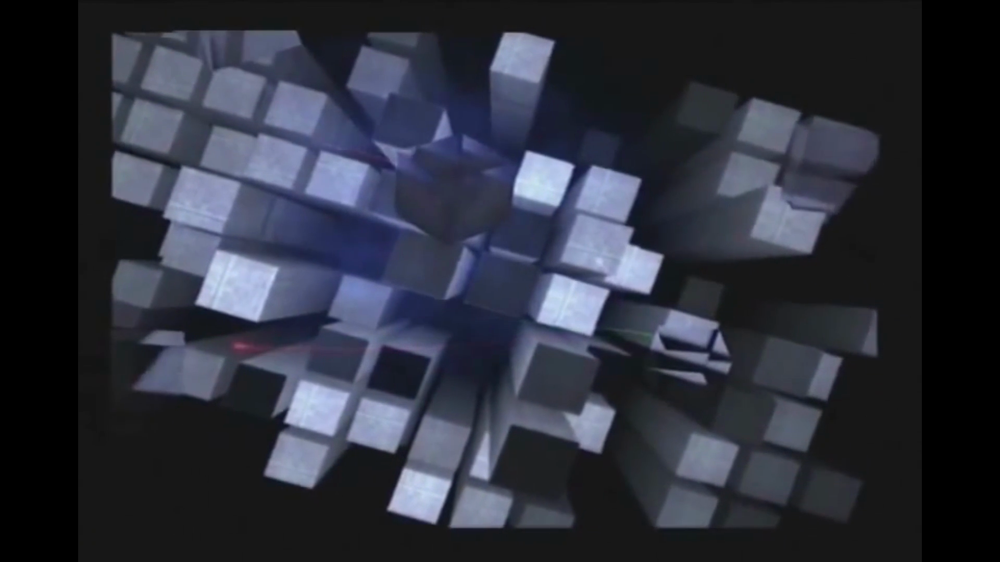

<div align="center">

# PS2 Startup Screen

**The iconic PlayStation 2 tower sequence, recreated in the browser.**

Built with Three.js, React Three Fiber, and deployed on Cloudflare Workers.

[](https://react.dev/)
[](https://threejs.org/)
[](https://www.typescriptlang.org/)
[](https://vite.dev/)
[](https://workers.cloudflare.com/)

</div>

---

<div align="center">
  
  <br />
  <sub>Top-down overview at <code>t = 0.0s</code> — prism towers, central glow, floating cubes</sub>
</div>

## About

A faithful recreation of the **PlayStation 2 startup tower sequence** (`0.0s` – `9.5s`) — the mesmerizing scene of white prism towers, blue-purple central glow, floating cubes, and laser-like particle trails that every PS2 owner remembers.

All geometry is procedurally generated. No external 3D models. The visual target is the original PS2's slightly soft, slightly grainy rendering style — not modern and sharp.

## Scene Progression

<table>
  <tr>
    <td align="center" width="33%">
      
      <br />
      <sub><b>0.0s</b> — Overhead view</sub>
    </td>
    <td align="center" width="33%">
      
      <br />
      <sub><b>4.0s</b> — Orbital rotation</sub>
    </td>
    <td align="center" width="33%">
      
      <br />
      <sub><b>7.5s</b> — Camera acceleration</sub>
    </td>
  </tr>
</table>

## Features

- **Prism Field** — 60–80 instanced box pillars with varying heights, grid placement with jitter
- **Central Glow** — Blue-purple point light with additive-blended glow sprites
- **Floating Cubes** — Dark, semi-transparent cubes drifting between the towers
- **Particle Trails** — Red, green, and blue-purple laser lines weaving through the scene
- **Camera Animation** — Scripted orbital motion: slow rotation → acceleration → rush into towers
- **Fade to Black** — Dual fade via lighting reduction + CSS overlay, complete by `9.5s`
- **PS2-Style Rendering** — Reduced DPR, disabled antialiasing, film grain, vignette

## Tech Stack

| Layer           | Technology                   |
| --------------- | ---------------------------- |
| 3D Engine       | Three.js + React Three Fiber |
| Framework       | React 19 + vinext            |
| Styling         | Tailwind CSS 4               |
| Language        | TypeScript 5.9               |
| Build           | Vite 8                       |
| Deploy          | Cloudflare Workers           |
| Post-Processing | @react-three/postprocessing  |

## Getting Started

**Prerequisites:** [Bun](https://bun.sh/)

```bash
# Install dependencies
bun install

# Start dev server
bun run dev

# Build for production
bun run build

# Preview production build
bun run start
```

## Scripts

| Command             | Description                           |
| ------------------- | ------------------------------------- |
| `bun run dev`       | Start the development server          |
| `bun run build`     | Create a production build             |
| `bun run start`     | Run the built app locally             |
| `bun run lint`      | Run lint checks                       |
| `bun run typecheck` | Run type-aware linting                |
| `bun run check`     | Run formatting, lint, and type checks |
| `bun run fmt`       | Check formatting                      |
| `bun run fmt:fix`   | Auto-fix formatting                   |

## Project Structure

```
src/
├── app/                      # App entry (page.tsx, layout.tsx)
├── components/
│   ├── Scene.tsx             # Canvas setup + orchestration
│   └── scene/
│       ├── config.ts         # All tunable parameters
│       ├── timeline.ts       # Phase / fade / speed helpers
│       ├── PrismField.tsx    # InstancedMesh tower grid
│       ├── GroundPlane.tsx   # Dark ground plane
│       ├── CentralGlow.tsx   # Point light + glow sprites
│       ├── FloatingCubes.tsx # Semi-transparent drifting cubes
│       ├── ParticleTrails.tsx# Laser-line particle system
│       ├── Lighting.tsx      # Directional + ambient lights
│       ├── CameraRig.tsx     # Scripted camera animation
│       ├── PostProcessing.tsx# Grain + vignette
│       └── FadeOverlay.tsx   # CSS black overlay
├── lib/                      # Texture generation helpers
└── shaders/                  # Custom shader code
```

## Verification

Visual accuracy is validated frame-by-frame against the [original PS2 startup video](docs/assets/PS2%20Startup%20Screen.mp4).

| Timestamp | Checkpoint                              |
| --------- | --------------------------------------- |
| `0.0s`    | Top-down angle, pillar density          |
| `1.0s`    | Early rotation, central glow visibility |
| `4.0s`    | Particle trails, floating cubes         |
| `7.0s`    | Zoom level before acceleration          |
| `8.5s`    | Fade progression during rush            |
| `9.5s`    | Pure black frame                        |

```bash
# Extract any reference frame
ffmpeg -ss <seconds> -i "docs/assets/PS2 Startup Screen.mp4" -frames:v 1 -q:v 2 /tmp/ps2-ref.jpg
```

## License

MIT
