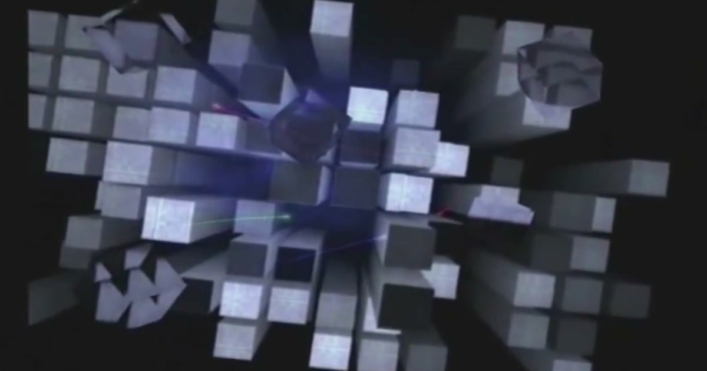

<div align="center">

# Portfolio

**A personal portfolio site inspired by the PlayStation 2 startup and browser UX.**

Built with Three.js, React Three Fiber, and deployed on Cloudflare Workers.

[](https://react.dev/)
[](https://threejs.org/)
[](https://www.typescriptlang.org/)
[](https://vite.dev/)
[](https://workers.cloudflare.com/)

**[posaune0423.com](https://posaune0423.com)**

</div>

---

<div align="center">
  
  <br />
  <sub>PS2 startup tower animation — the opening experience</sub>
</div>

## About

A portfolio website that recreates the **PlayStation 2** experience — from the iconic startup tower animation to the memory card browser interface. Visitors are greeted with the PS2 boot sequence, then navigate through a PS2-style menu to explore work history and social links.

All 3D geometry in the startup scene is procedurally generated. No external 3D models. The visual target is the original PS2's slightly soft, slightly grainy rendering style.

## Site Flow

```
/ (PS2 Startup Animation)
  → /menu (Browser / System Configuration)
      → /browser (Memory Card Browser)
          → /memory/work (Work Portfolio Grid)
          → /memory/sns (SNS Links Grid)
      → /system (System Configuration)
```

1. **Startup Animation** — The PS2 tower sequence plays for ~9.5s, then transitions to the menu
2. **Main Menu** — Choose between "Browser" (portfolio content) and "System Configuration"
3. **Memory Card Browser** — Two memory cards: Work and SNS
4. **Work Portfolio** — Project cards displayed as memory card save data
5. **SNS** — Social links (GitHub, X, LinkedIn) in the same PS2 browser style

## Features

- **PS2 Startup Scene** — Prism towers, central glow, floating cubes, particle trails, camera animation, fade to black
- **PS2 Browser UI** — Memory card browser with glow cursor navigation
- **3D Portfolio Items** — GLB models for work projects and SNS icons
- **Keyboard & Gamepad Navigation** — Arrow keys, Enter, Escape for full PS2-like interaction
- **Haptic Feedback** — Vibration on supported devices
- **Sound Effects** — PS2-style audio for navigation and ambience
- **PS2-Style Rendering** — Reduced DPR, film grain, vignette for era-authentic visuals
- **i18n** — Multi-language support

## Tech Stack

| Layer           | Technology                   |
| --------------- | ---------------------------- |
| 3D Engine       | Three.js + React Three Fiber |
| Framework       | React 19 + vinext            |
| Styling         | Tailwind CSS 4               |
| Language        | TypeScript 5.9               |
| Build           | Vite 8                       |
| Deploy          | Cloudflare Workers           |
| Post-Processing | @react-three/postprocessing  |
| Audio           | use-sound + Howler.js        |
| Haptics         | use-haptic                   |

## Getting Started

**Prerequisites:** [Bun](https://bun.sh/)

```bash
# Install dependencies
bun install

# Start dev server
bun run dev

# Build for production
bun run build

# Preview production build
bun run start
```

## Scripts

| Command             | Description                           |
| ------------------- | ------------------------------------- |
| `bun run dev`       | Start the development server          |
| `bun run build`     | Create a production build             |
| `bun run start`     | Run the built app locally             |
| `bun run lint`      | Run lint checks                       |
| `bun run typecheck` | Run type-aware linting                |
| `bun run check`     | Run formatting, lint, and type checks |
| `bun run fmt`       | Check formatting                      |
| `bun run fmt:fix`   | Auto-fix formatting                   |

## Project Structure

```
src/
├── app/                          # Pages (file-based routing)
│   ├── page.tsx                  # Home — PS2 startup animation
│   ├── layout.tsx                # Root layout with providers
│   ├── menu/page.tsx             # Main menu
│   ├── browser/page.tsx          # Memory card browser
│   ├── system/page.tsx           # System configuration
│   └── memory/
│       ├── work/page.tsx         # Work portfolio grid
│       └── sns/page.tsx          # SNS links grid
├── components/
│   ├── Scene.tsx                 # Canvas setup + animation orchestration
│   ├── BrowserMenu.tsx           # Main menu UI
│   ├── scene/                    # PS2 startup scene components
│   │   ├── config.ts             # Tunable parameters
│   │   ├── timeline.ts           # Phase / fade helpers
│   │   ├── PrismField.tsx        # Instanced tower grid
│   │   ├── CentralGlow.tsx       # Point light + glow sprites
│   │   ├── FloatingCubes.tsx     # Drifting cubes
│   │   ├── ParticleTrails.tsx    # Laser-line particles
│   │   ├── CameraRig.tsx         # Scripted camera animation
│   │   └── ...
│   ├── shared/                   # Reusable UI (grid, cursor, nav)
│   ├── browser-menu/             # Menu components
│   └── system/                   # System page components
├── constants/                    # Site metadata
├── lib/                          # Texture generation, i18n, audio
└── shaders/                      # Custom GLSL shaders
```

## License

MIT
